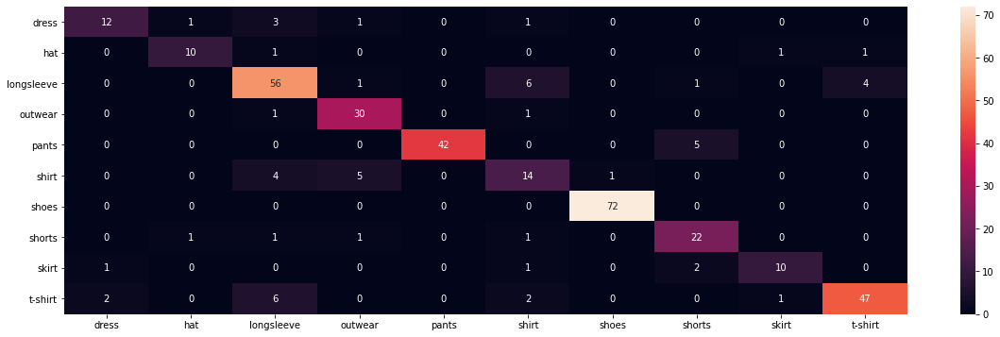

# Clothes Classification

### Data

[Subset of clothing dataset](https://github.com/alexeygrigorev/clothing-dataset-small) with the top-10 most popular classes from the [full clothing dataset](https://github.com/alexeygrigorev/clothing-dataset). This is relatively small dataset (~106MB unpacked) with train/validation/test split and over 3800 images in total.

### Model

[MobileNetV2](https://arxiv.org/abs/1801.04381) was used for training due to its small size (~15MB). To be more specific, it was [Keras MobileNetV2](https://keras.io/api/applications/mobilenet/) with ImageNet weights and no top layers included. Instead of top part, few layers were added:

```python
model = tf.keras.Sequential()
model.add(mobileNet_base)
model.add(tf.keras.layers.GlobalAveragePooling2D())
model.add(tf.keras.layers.Dense(256, activation='relu'))
model.add(tf.keras.layers.Dropout(0.2))
model.add(tf.keras.layers.Dense(128, activation='relu'))
model.add(tf.keras.layers.Dropout(0.1))
model.add(tf.keras.layers.Dense(config.num_classes, activation='softmax'))
```

Base part (extraction) of MobileNetV2 was frozen during this training. Only dense layers were trained.

### Training

Before training, data was preprocessed using:
- range conversion, to transform pixel values to [0, 255] range from [-1, 1],
- resizing function to convert all images to (224, 224) size,
- built-in Keras MobileNetV2 preprocesssing function (to transform images to the expected format).

Model was trained for 300 epochs with early stopping (finished after 48 epochs) and:
- Adam optimizer (lr = 1e-3),
- CategoricalCrossEntropy loss,
- batch size = 64,
- seed = 2020 used only for training set,
- augmentations (rotation, width/height shift, zoom, horizontal flip) for training and validation,
- ReduceLROnPlateau callback, reducing LR by a factor of 0.25 every 10 epochs with no improvement (delta 1e-2).

History visualization (training and validation sets) after 48 epochs:


Confusion Matrix for the hold-out test set:



### Inference

To test the model, use `inference.py` script which takes only one argument: image url. As an output, the script prints predicted class name (with the highest score) and softmax score for that class. Example usages:

```
python inference.py --url "https://images-na.ssl-images-amazon.com/images/I/816gWcWYTuL._UL1500_.jpg"
```
> Predicted class: t-shirt (confidence score: 1.00000)

```
python inference.py --url "https://image.made-in-china.com/202f0j00yUrfpcYJYekG/Propeller-Hat-Colorful-Patchwork-Custom-Design-Cotton-Funny-Baseball-Hats.jpg"
```
> Predicted class: hat (confidence score: 0.99997)
